# Practica 3.2 3.4

## Introduccion
 En la práctica 3.2, vamos a clonar un repositorio, y inicializar un proyecto Node.js. Luego en la páctica 3.4 vamos desplegar nuestro proyecto en remoto mediante la plataforma Netlify de dos formas, la primera usando el netlify deploy y otra es enlazando netlify con github.

## Práctica 3.3:
### Clonar repositorio:
Primero vamos a clonar el repositorio ```https://github.com/StackAbuse/color-shades-generator``` usando el comando de git:

    git clone https://github.com/StackAbuse/color-shades-generator

Luego nos metemos en la carpeta clonada:

    cd color-shades-generator

### Node:
Instalamos el paquete de Node.js usando ```npm``` (Node Package Manager):

    npm install

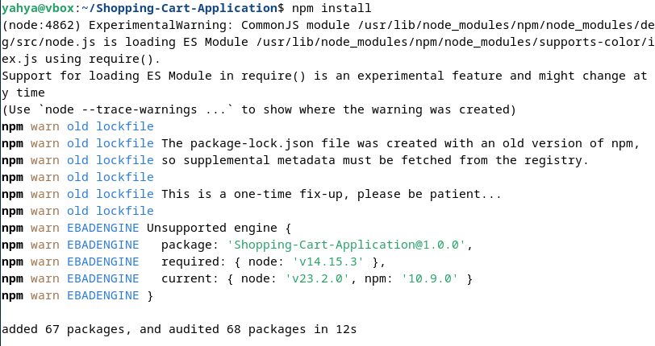

Y ahora ejecutmos el comando:

    npm run start

nos sale el error: 

    sh: 1: nodemon: not found

Este error indica que no esta instalado el nodemon.

Para solucionarlo hay que instala el ```nodemon``` que es una herramienta muy útil en el desarrollo de aplicaciones Node.js, y su propósito principal es automatizar el proceso de reiniciar la aplicación cada vez que detecta cambios en los archivos del proyecto.

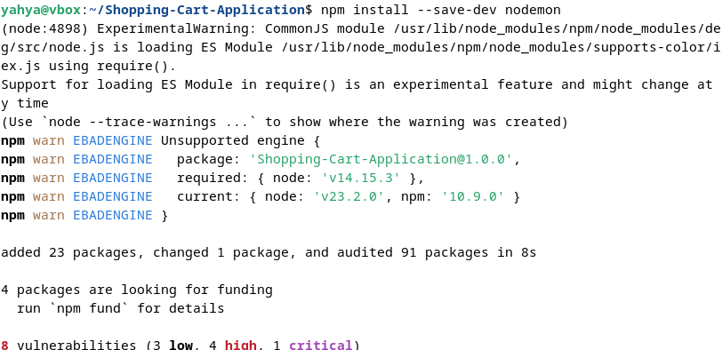

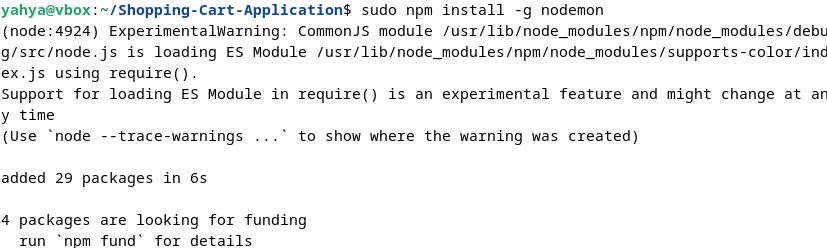


## Practica 3.4:
En esta practica vamos a desplegar nuestro proyecto ```Node.js``` usando ```Netlify```:

### Habilitamos ```SSH```:
Para poder controlar el servidor desde nuestra maquina anfitriona:

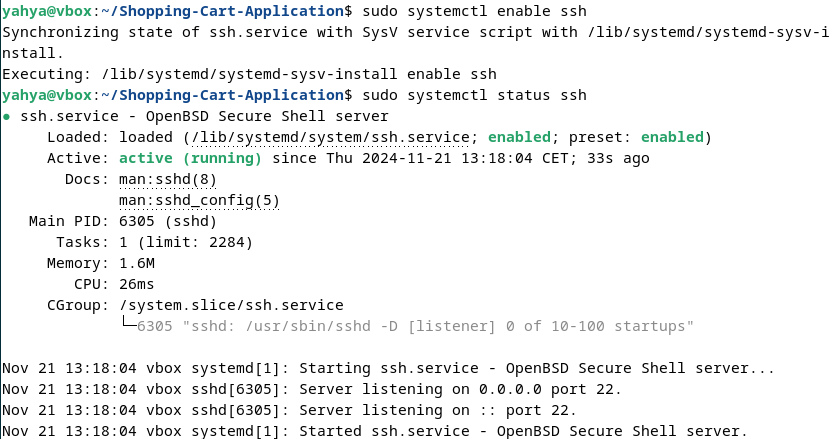

### Nos conectamos con el servidor:
Y ahora vamos a conectarnos con el servidor ejecutando el comando:

    ssh <nombre-servidor>@<IP-SERVIDOR>

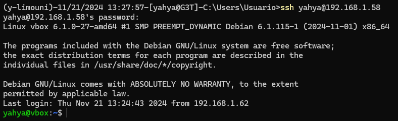

### Crear app:
Creamos una aplicacion con la estructura siguiente:

    |__ head.html <br>
    |__ tail.html <br>
    |__ aplicacion.js <br>

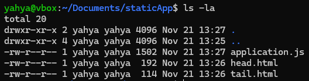

### Crear el package JSON:

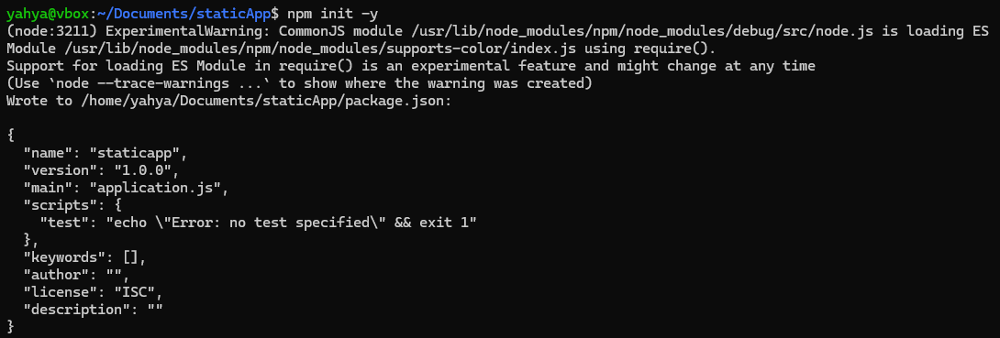

### Y desplegamos la app en local en el puerto 8080:

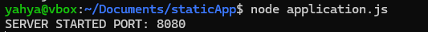

Visualizamos la pagina desplegada:

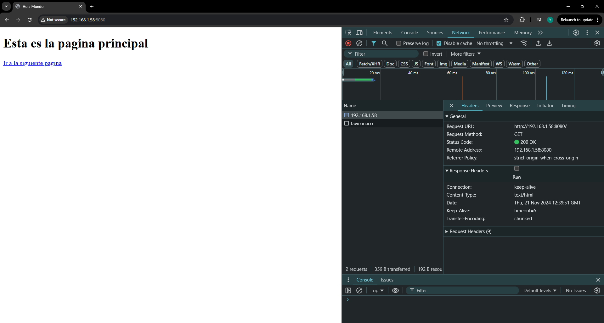

### Despliegue NETLIFY:
Ahora procedemos al despliegue en ```NETLIFY```

#### Nos clonamos el repositorio necesario:

    git clone https://github.com/StackAbuse/color-shades-generator

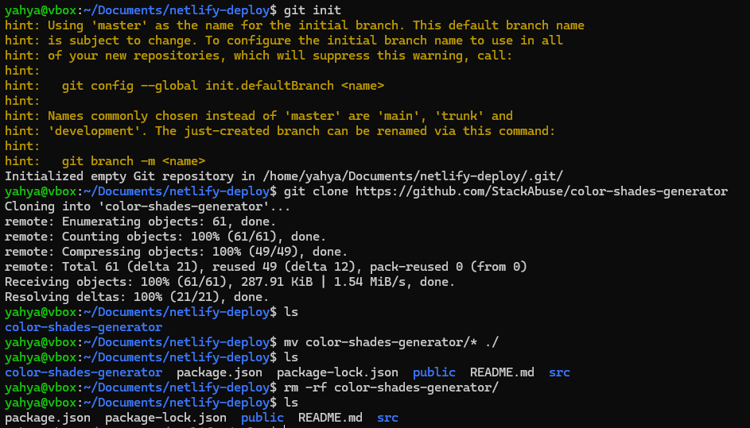

#### Nos registramos en ```NETLIFY```:

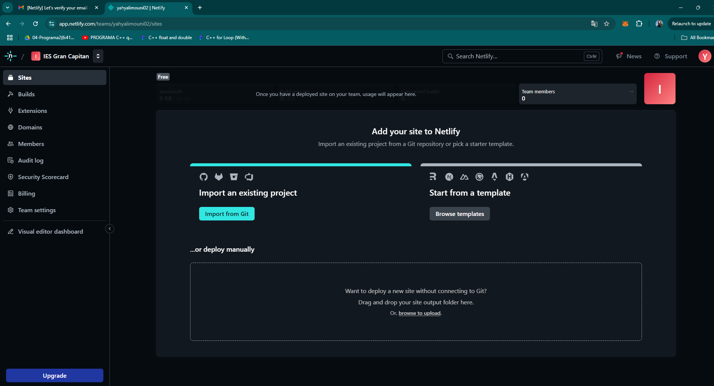

#### Instalacion y login:

Nos instalamos NETLIFY y creamos una variable de entorno que tendrá el token generado para que podamos logearnos sin usar un entorno grafico ya que en un escenario real todo se manejará mediante SSH.

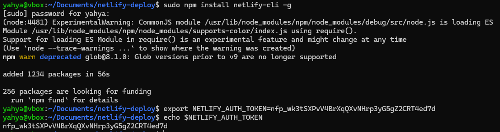

Nos logeamosÑ

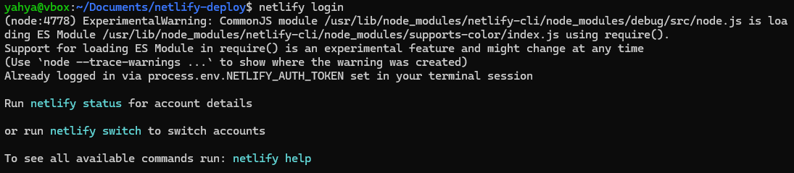

#### Build & Deploy

Ejecutamos el siguiente comando para generar el directorio ```build``` que se va a desplegar.

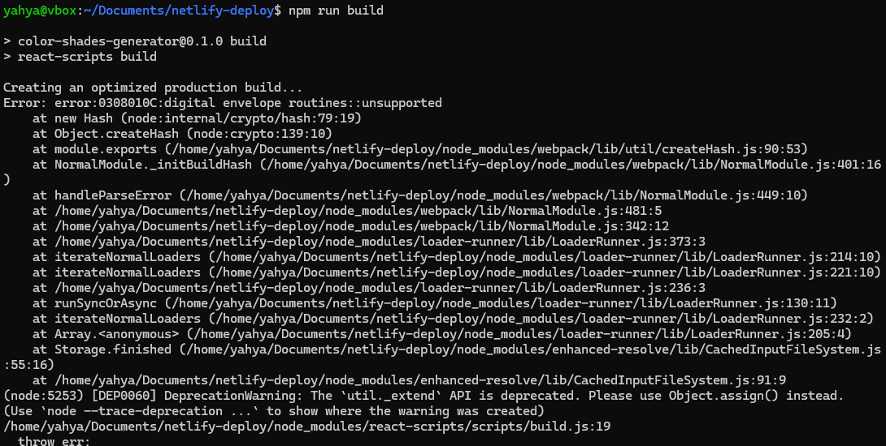

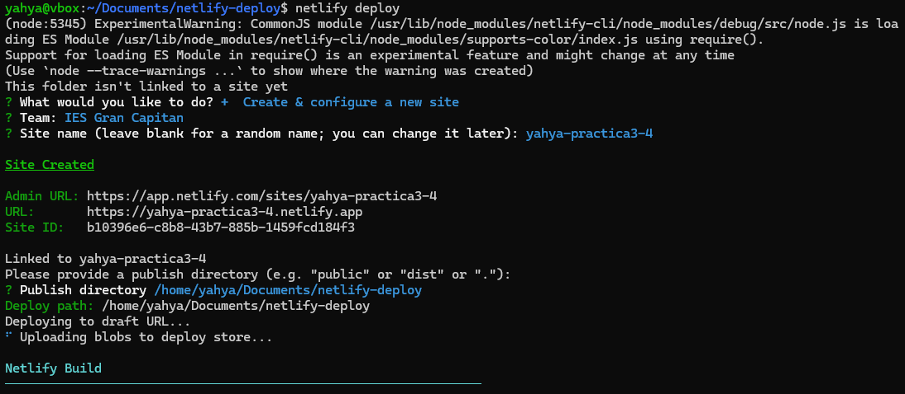


Visualizamos la pagina desplegada mediante NETLIFY:

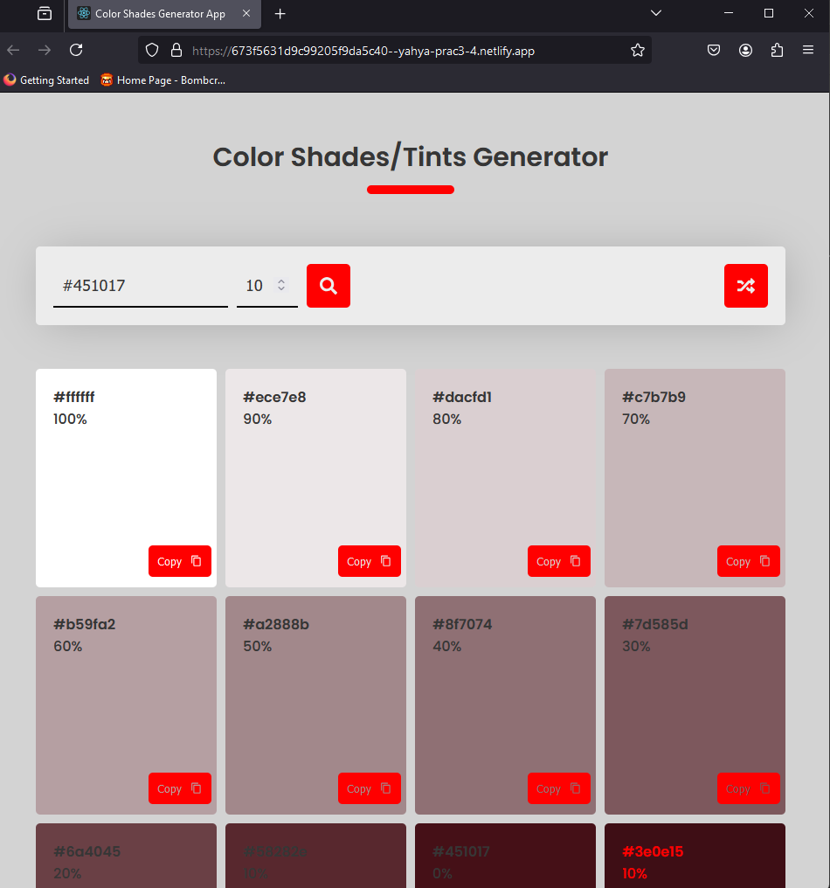

### Despliegue NETLIFY enlazando un repositorio de GitHub:

#### Borramos la web desplegada antes:

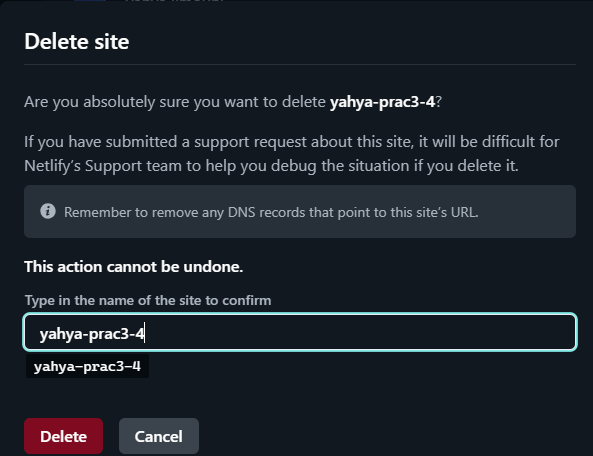

#### Nos descargamos el zin que tiene la nueva aplicacion ```main.zip```:   

    wget https://github.com/StackAbuse/color-shades-generator/archive/refs/heads/main.zip

Lo descomprimimos en la carpeta practica3.4

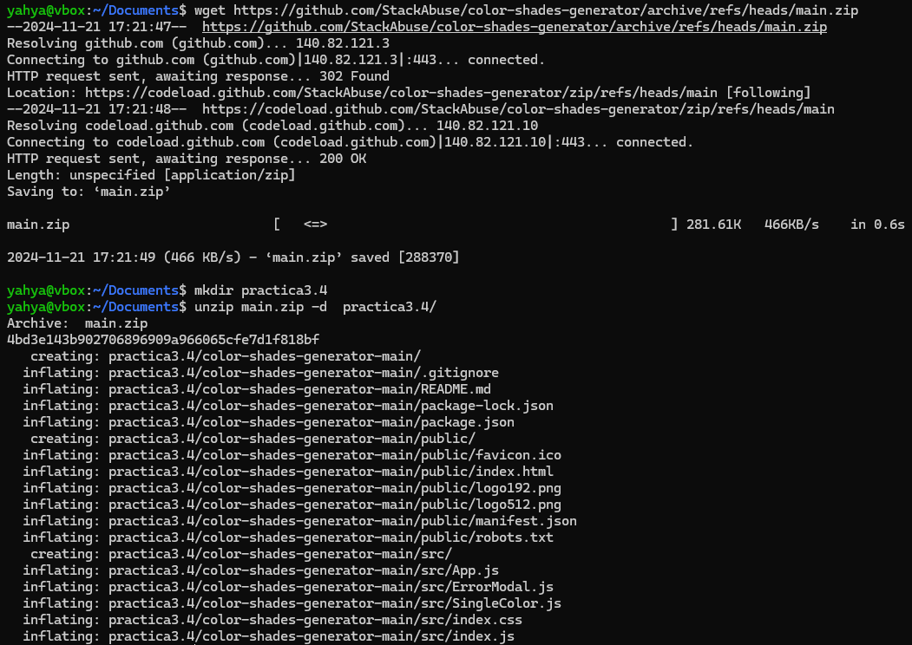

#### Crear Repo

Creamos un repositorio en nuestra cuenta de GitHub.
Hacemos el primer commit y subimos el proyecto:

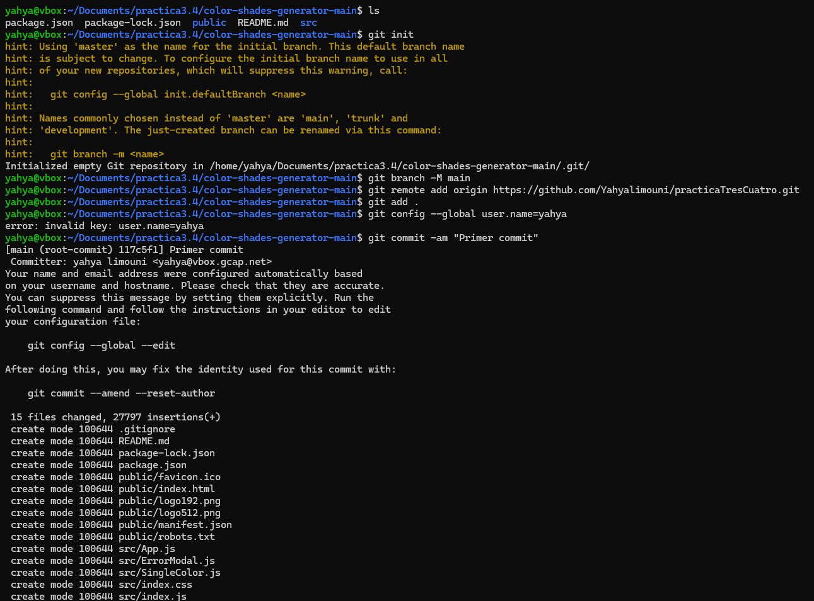

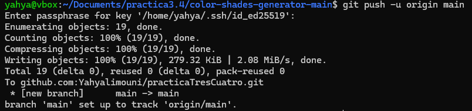

### Enlazar con NETLIFY

Enlazamos nuestro repositorio de GitHub con la plataforma NETLIFY para que cada vez que se hace un push, despliega los cambios.

1. Le damos a import from Git

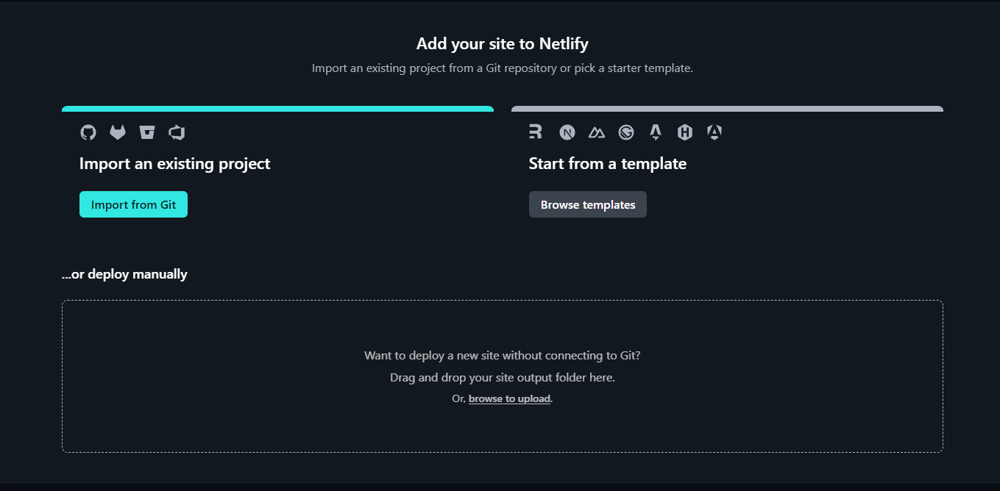

2. Elegimos la opcion Github

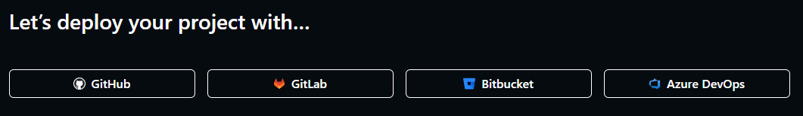

3. Rellenamos los campos necesarios y le damos a desplegar

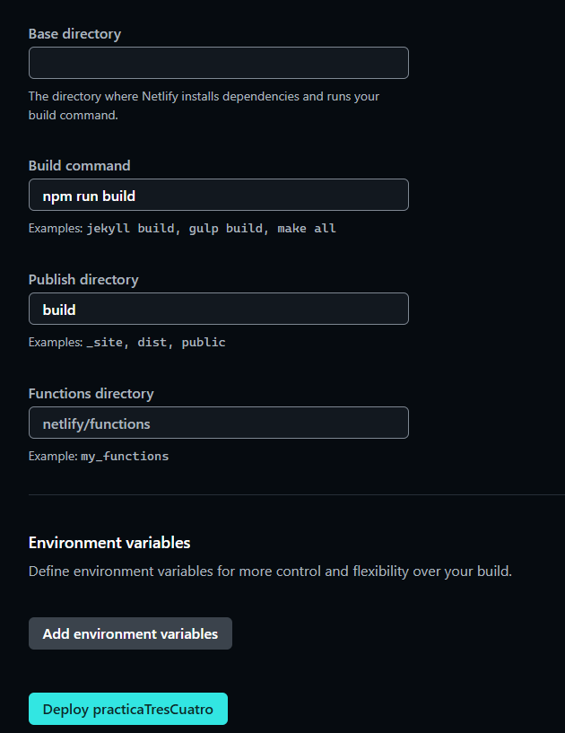

Y ya nuestra aplicacion se desplegará.

para probar l auto despliegue de la app.

Miramos el archivo robots.txt que está en public.

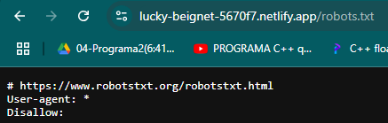

Lo modificamos poniendo /yahya-limouni/
y verificamos si se ha desplegado correctamente

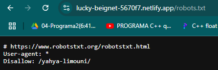
